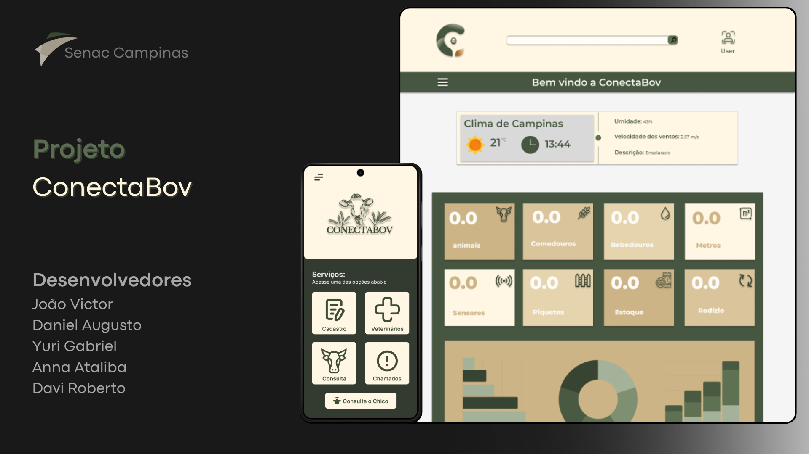

<h1 align="center">Projeto ConectaBov</h1>

<p align="center">
  Projeto Integrador desenvolvido como proposta para o Senac Campinas
</p>

<p align="center">
  <a href="#tecnologias">Tecnologias</a>&nbsp;&nbsp;&nbsp;|&nbsp;&nbsp;&nbsp;
  <a href="#projeto">Projeto</a>&nbsp;&nbsp;&nbsp;|&nbsp;&nbsp;&nbsp;
  <a href="#layout">Layout</a>&nbsp;&nbsp;&nbsp;|&nbsp;&nbsp;&nbsp;
  <a href="#funcionalidades">Funcionalidades</a>&nbsp;&nbsp;&nbsp;|&nbsp;&nbsp;&nbsp;
  <a href="#api">API</a>
</p>

<p align="center">
  
</p>


<h2 id="api">🐄 API ConectaBov</h2>

A ConectaBov surgiu como uma proposta de avanço no setor pecuário, sendo um site focado na centralização e tratamento de dados voltados à gestão e produtividade no campo.  

<h2 id="funcionalidades">🛠️ Funcionalidades</h2>

- 📊 Visualização de dados
- 📋 Cadastro de animais
- 🧑‍⚕️ Consulta de veterinários
- 🚨 Sistema de chamados
- 🌦️ Previsão do clima
- 🤖 Bot de atendimento
- 🔑  Cadastro e login de usuários com validação dos dados 


---

<h2 id="tecnologias">🚀 Tecnologias do Front-end</h2>

Esse projeto foi desenvolvido com as seguintes tecnologias:

- 🌐 HTML 
- 🎨 CSS 
- ⚙️ JavaScript
- 🔧 Git 
- 🐱 GitHub
- 🖌️ Figma

<br>


### 📌 Tecnologias Utilizadas no Back-end

-  Node.js
-  Express
-  MongoDB com Mongoose
-  bcrypt (para hash de senhas)
-  JSON Web Token (JWT) para autenticação
-  Joi para validação de dados
-  dotenv para gerenciamento de variáveis de ambiente
-  cors para permitir requisições cross-origin
-  nodemon para desenvolvimento

<br>

  <h2 id="layout">🎨 Layout</h2>

O layout foi desenvolvido no Figma e está disponível [aqui](https://www.figma.com/design/Crtni8Cp3H1taxwYU4Ivn2/Projeto-integrador-UC---16?node-id=33-2&t=832eXJNOAVPOGbTy-1).

---

### 🚀 Como Rodar a API

1. Clone o repositório  
```bash
git clone <URL-do-repositório>
```
2. Instale as dependências 
```bash
npm install
```
3. Configure as variáveis de ambiente
```bash
PORT=3000
MONGODB_URI=<string de conexão com MongoDB>
JWT_SECRET=<chave secreta para JWT>
```
4. Inicie o servidor
```bash
npm run dev
```
## 👥 Equipe

Projeto desenvolvido por:

- [João Victor](https://github.com/Johnizidro)
- [Davi Roberto](https://github.com/Davi-git1)
- [Yuri Gabriel](https://github.com/yuri522)
- [Daniel Santos](https://github.com/dasantos2)
- [Anna Ataliba](https://github.com/AnnaAtaliba)

---

<p align="center">Feito com ♥ por todos os integrantes da ConectaBov</p>
